# cyrio 拯救你的帝盟Rio MP3播放器

**无需32位电脑+帝盟古老驱动，现代设备直接传曲和管理。**

[赞助：https://ifdian.net/a/cyanteam](https://ifdian.net/a/cyanteam)

Diamond Rio S-Series USB MP3 播放器管理工具（纯 Rust，跨平台）。

## 软件截图

### 桌面端（Tauri）

<table><tr>
<td width="800" align="center">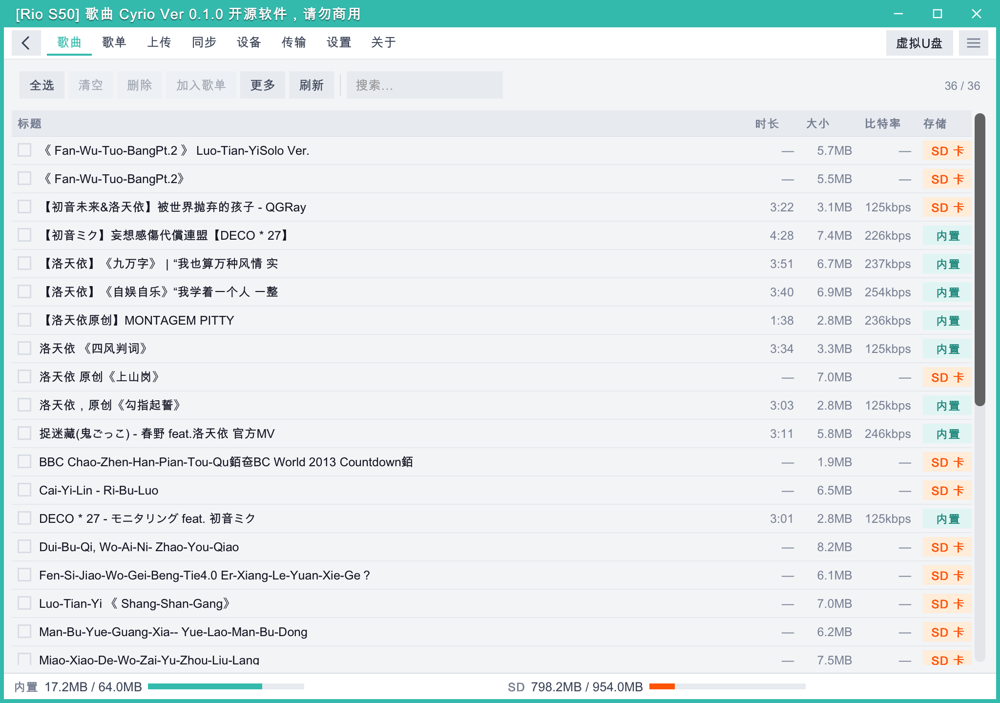<br><b>歌曲</b></td>
<td width="800" align="center">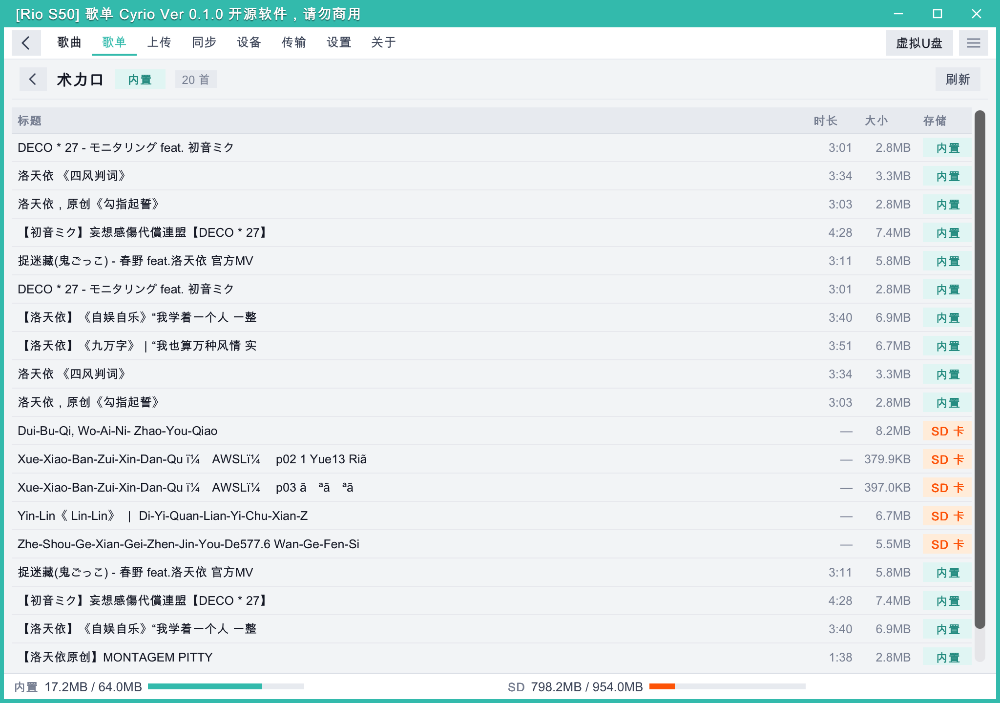<br><b>歌单列表</b></td>
<td width="800" align="center">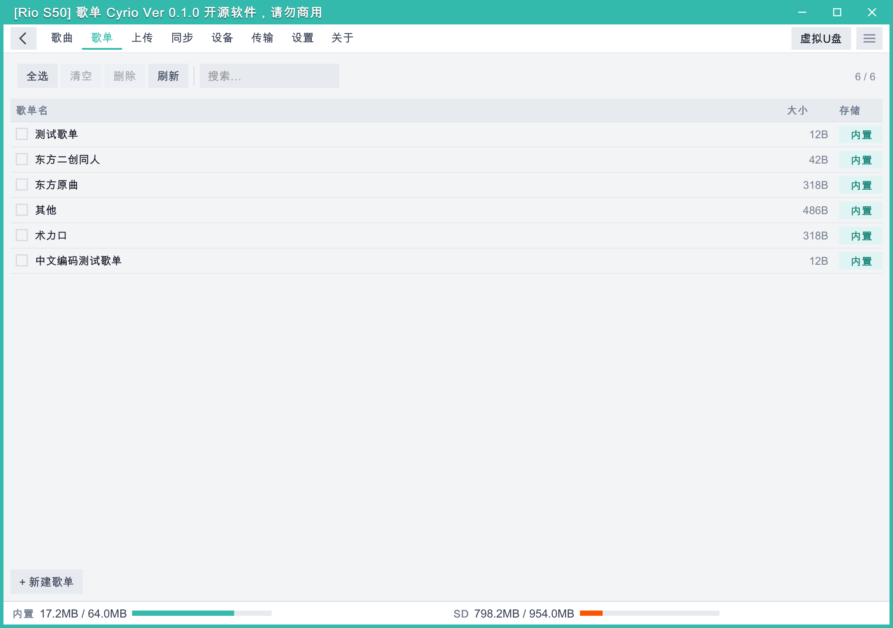<br><b>歌单详情</b></td>
<td width="800" align="center">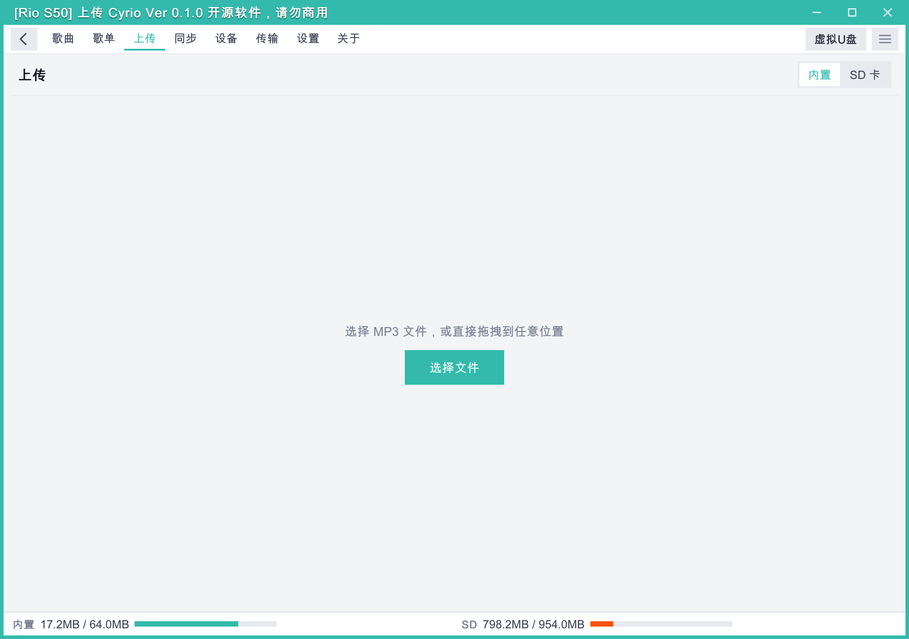<br><b>上传</b></td>
<td width="800" align="center">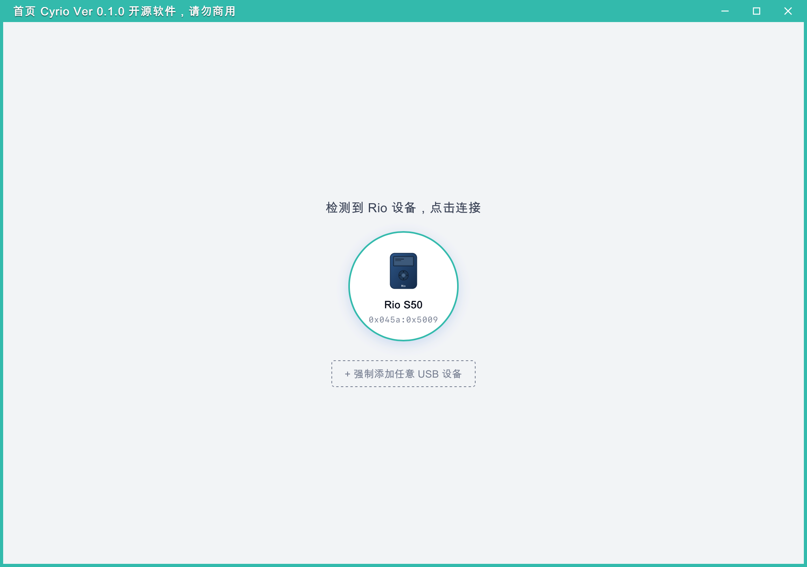<br><b>设备连接</b></td>
<td width="800" align="center">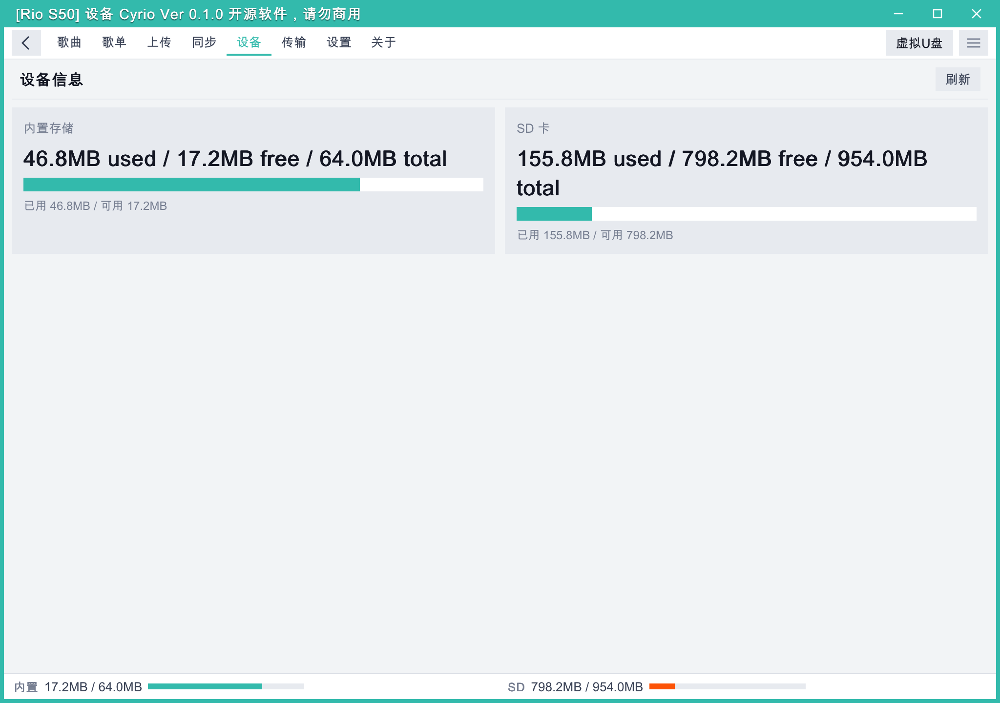<br><b>设备信息</b></td>
<td width="800" align="center">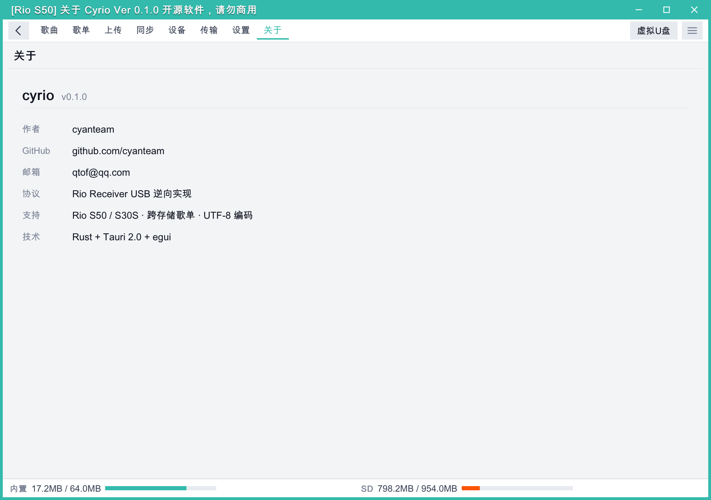<br><b>关于</b></td>
</tr></table>

### Android 端

<table><tr>
<td width="400" align="center">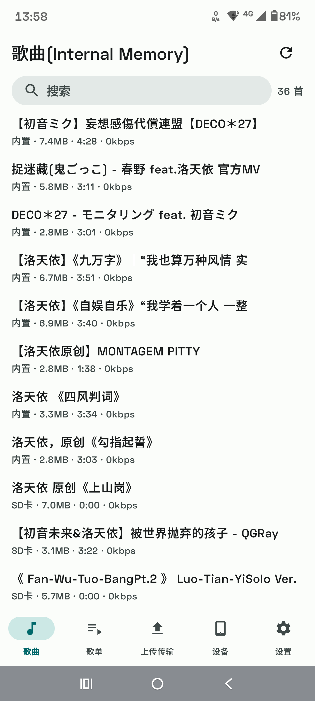<br><b>歌曲</b></td>
<td width="400" align="center">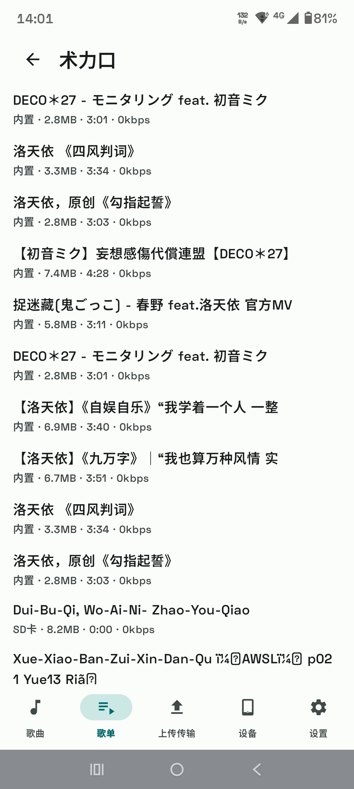<br><b>歌单列表</b></td>
<td width="400" align="center">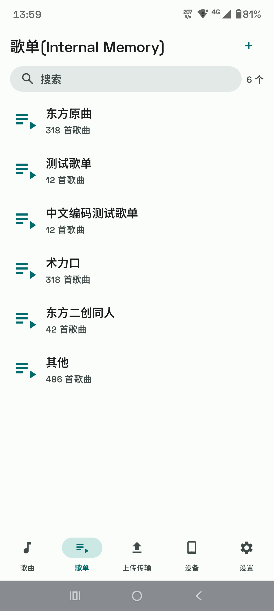<br><b>歌单详情</b></td>
<td width="400" align="center">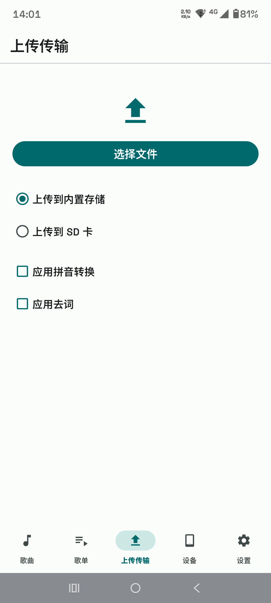<br><b>上传</b></td>
<td width="400" align="center">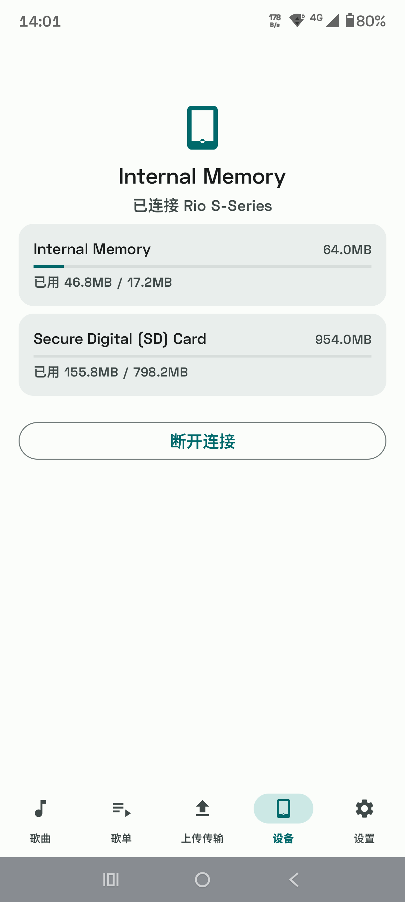<br><b>设备信息</b></td>
<td width="400" align="center">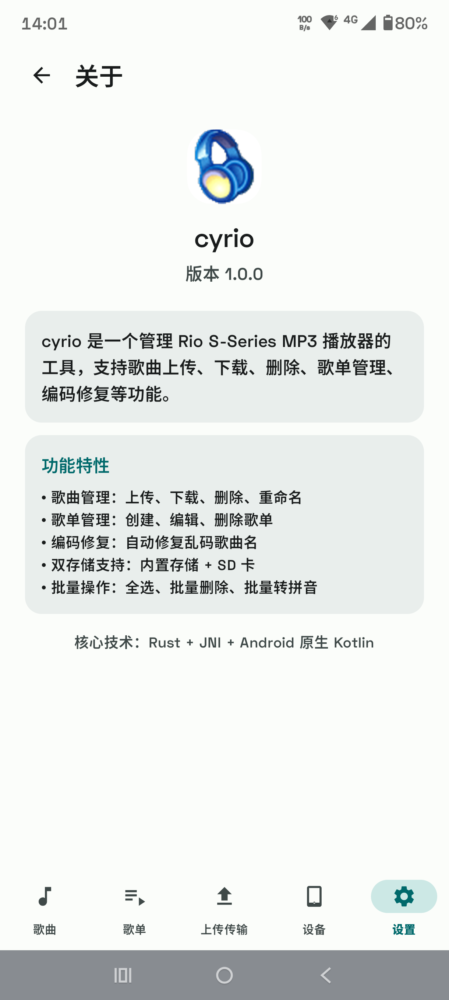<br><b>关于</b></td>
</tr></table>

## 软件优势

- **告别老旧驱动** — 无需寻找 32 位电脑、无需安装帝盟官方驱动，现代 macOS / Windows / Linux / Android 设备即插即用
- **全平台覆盖** — 桌面端（Tauri 2）和 Android 原生应用，同一套 Rust 核心协议，体验一致
- **纯 Rust 实现** — 从 USB 协议到音频播放，全部 Rust 原生编写，无 GC 延迟，内存安全
- **WebDAV 虚拟U盘** — 内置 WebDAV 服务器，可将 Rio 设备映射为网络磁盘，用文件管理器直接拖拽传曲
- **批量管理** — 批量上传 / 删除 / 转拼音 / 去词 / 修复编码，一键处理大量歌曲
- **歌单管理** — 支持创建、编辑、查看歌单，歌曲可加入或移出歌单
- **内置播放试听** — 双击即可试听设备中的歌曲，无需导出
- **双存储支持** — 同时管理内置存储和 SD 卡，自动识别存储容量与使用情况
- **演示模式** — 无需连接真实设备即可预览全部功能界面

## 平台支持

| 平台 | 框架 | 状态 |
|------|------|------|
| macOS / Linux / Windows | Tauri 2 | ✅ 主要版本 |
| Android | 原生 Kotlin + JNI | ✅ 主要版本 |
| macOS / Linux / Windows | egui | ✅ 可用，开发中 |
| Web (WASM) | webusb-web | 🟡 正在适配 |
| macOS / Linux / Windows | GPUI | 🟡 开发中 |

## 仓库结构

本仓库为 monorepo，包含核心协议层和所有平台前端实现：

```
cyrio/
├── crates/
│   ├── cyrio-core/                 # Rio S-Series USB 协议核心库
│   ├── cyrio-text/                 # 文本处理（拼音转换、噪音词过滤）
│   ├── cyrio-transport-nusb/       # 桌面 USB transport（nusb）
│   ├── cyrio-transport-webusb/     # Web USB transport（WASM）
│   ├── cyrio-audio/                # 音频播放抽象（rodio）
│   ├── cyrio-webdav/               # WebDAV 虚拟U盘
│   ├── cyrio-app/                  # egui 共用应用
│   ├── cyrio-tauri/                # Tauri 2 后端
│   └── cyrio-jni/                  # Android JNI 桥接
├── platforms/
│   ├── desktop/                    # egui 桌面入口
│   ├── tauri-desktop/              # Tauri 2 桌面入口
│   ├── gpui-desktop/               # GPUI 桌面入口（开发中）
│   └── android-native/             # Android 原生（Kotlin）
└── docs/PROTOCOL.md                # 协议规范
```

## 使用

### **[Release](https://github.com/cyanteam/cyrio/release)**

## 编译

### 前置条件

- Rust 1.75+（推荐 rustup 最新 stable）
- Node.js 18+（Tauri 前端构建）
- Android SDK + NDK 27（Android 构建）

### 桌面版（Tauri）

```bash
cd platforms/tauri-desktop/frontend
npm install
npm run build
cd ../..
cargo run -p cyrio-tauri
```

### 桌面版（egui）

```bash
cargo run -p cyrio-desktop
```

### Android

```bash
cd platforms/android-native
./build-android.sh    # 构建 .so + APK
```

## 架构

- **GUI 解耦**：UI ↔ 后台通过 channel 消息传递（`async-channel`）
- **异步运行时**：`smol`（不依赖 tokio）
- **USB 传输**：trait 抽象，桌面用 nusb，Android 用 JNI UsbManager
- **核心协议**：rioutil 兼容算法，自实现 CRC32

## 协议规范

见 [docs/PROTOCOL.md](docs/PROTOCOL.md)。

## License

MIT
